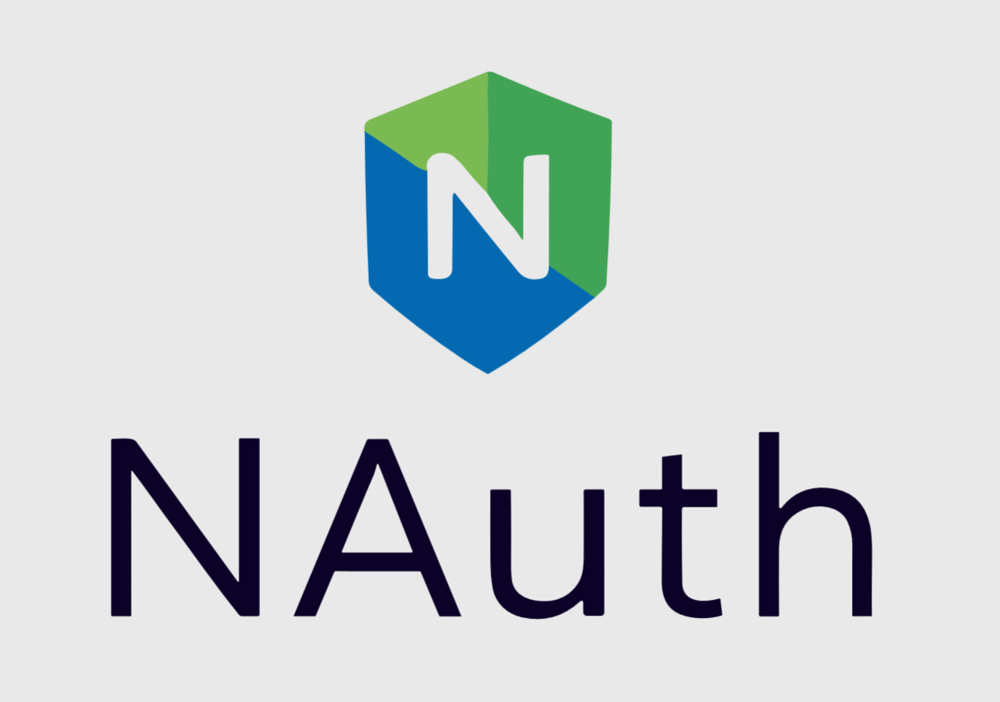

<p align="center">
    
</p>

# NAUTH
A Kubernetes operator for managing [decentralized authentication & authorization for NATS](https://docs.nats.io/running-a-nats-service/configuration/securing_nats/auth_intro/jwt)

NAuth allows platform teams to provide easy multi-tenancy support for development teams by providing `Account` & `User` CRD:s that conveniently packages:

- Account creation & updates
- Account exports & imports
- User creation & credentials delivery

> [!WARNING]
> This project is in early development. There will likely be breaking changes before getting to a stable release.
> Instructions might be lacking, but will be built as we go.

## Installation
NAuth supports installation through packaged [Helm](https://helm.sh) charts.

```
helm install nauth oci://ghcr.io/wirelesscar --create-namespace --namespace nauth
```

### Pre-requisites
NAuth requires [NATS](https://nats.io) to be installed in the cluster, since NAuth integrates with NATS (over NATS) to provide the account JWT:s.
See examples of how to setup NATS with JWT auth together with NAuth in the [examples](./examples) directory.

## Getting Started
Running a large NATS cluster requires that the operator is secured properly. If you do not already have an operator, try
out the [operator-bootstrap](./operator-bootstrap) utility which comes with NAuth.

You can also use [`nsc`](https://github.com/nats-io/nsc) directly to create a throw-away operator & system account.

## More on decentralized JWT Auth
Check out this video for a comprehensive description on how decentralized JWT Auth works. In order to work with NAuth,
it's important to have an understanding of how the basics work.

<p align="center">
    <iframe width="33%" height="200" src="https://www.youtube.com/embed/5pQVjN0ym5w" frameborder="0" allowfullscreen></iframe>
</p>

## Nauth Development
Check out the [CONTRIBUTING](./CONTRIBUTING.md) guide.
