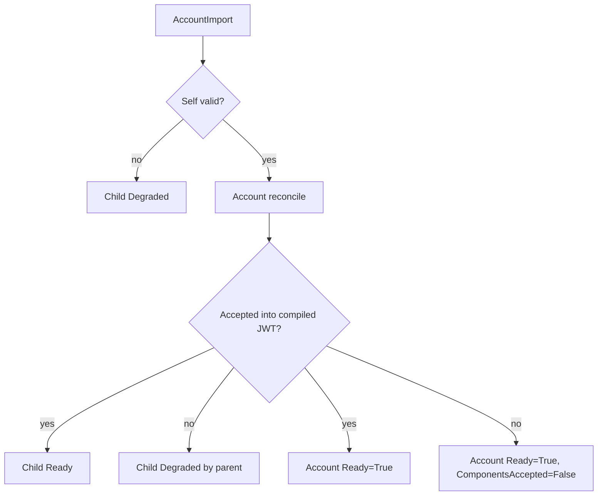

# ADR-6: Compose Account JWT from attached CRDs and reconcile on dependency changes

> [!WARNING]
> WIP draft generated by Codex.
> This document is intentionally committed only as a working draft and must be rewritten by a human before it can be considered an actual ADR.
> The team does not allow AI-authored ADRs as final artifacts.

Date: 2026-03-30

## Problem statement

NAuth needs a more scalable way to model account-level JWT configuration than keeping imports, exports, signing keys, limits, and other evolving concerns directly on the `Account` CRD.
At the same time, reconciliation can no longer rely only on `metadata.generation` and operator version, because `Account` behavior also depends on related resources such as `NatsCluster` and future child CRDs.

## Status

In progress

## Context

Today the main CRDs are:

- `NatsCluster`
- `Account`
- `User`

Current relationships:

- an `Account` is always bound to exactly one `NatsCluster`
- a `User` is always bound to exactly one `Account`

Current reconciliation is intentionally simple:

- if `generation` changed, reconcile
- if operator version changed, reconcile
- otherwise return early

That model works only while the `Account` resource is mostly self-contained.

The planned CRD evolution changes that:

- imports should move out of `Account` into `AccountImport`
- exports should move out of `Account` into `AccountExport`
- signing keys and/or scoped signing keys should move into dedicated CRDs such as `AccountSigningKey`

The intent is that:

- `Account` stays relatively static
- imports, exports, and signing keys can evolve independently
- all accepted parts are compiled into one Account JWT
- the compiled Account JWT is uploaded to NATS using the `NatsCluster` selected for the `Account`

This introduces new kinds of dependencies:

- `Account` depends on `NatsCluster`
- `Account` depends on attached child CRDs
- child CRDs may depend on other referenced resources
- some child CRDs may be individually valid but still rejected by `Account` compilation because of conflicts

Desired operator UX:

- malformed child CRDs should be visibly invalid on their own
- self-valid child CRDs should become ready for inclusion
- `Account` reconciliation may still reject some valid child CRDs
- rejected child CRDs should appear invalid/degraded
- the `Account` should still be considered operational if it can produce and upload a valid JWT
- the `Account` should also communicate partial success when some child resources were not included

## Options

### Option 1: Keep `Account` as the only real aggregate and move configuration fragments into attached CRDs

In this model:

- `Account` remains the aggregate root
- child CRDs represent fragments of desired Account JWT configuration
- child CRDs do not upload anything to NATS on their own
- `Account` reconciliation resolves the selected `NatsCluster`, gathers attached children, validates the full composition, builds the JWT, and uploads it
- child CRDs have their own self-validation status
- `Account` also writes parent-acceptance status onto child CRDs

This is conceptually similar to Gateway API attachment patterns:

- a child resource can be valid on its own
- a parent controller can still accept or reject it
- status on both parent and child describes the outcome

Recommended child CRDs:

- `AccountImport`
- `AccountExport`
- `AccountSigningKey`

Recommended relationship shape:

```text
NatsCluster -> Account -> User
                ^
                |
                +-- AccountImport
                +-- AccountExport
                +-- AccountSigningKey
```

Recommended runtime model:

```text
Account JWT =
  Account.spec
+ accepted AccountImport specs
+ accepted AccountExport specs
+ accepted AccountSigningKey specs
+ resolved NatsCluster details
```

Recommended status ownership:

- child controller owns child self-validation
- `Account` controller owns aggregate compilation and parent-acceptance result

Recommended status shape on children:

- self conditions such as:
  - `Accepted`
  - `ResolvedRefs`
  - `Ready`
- parent attachment entries such as:
  - target `Account`
  - controller name
  - `Accepted=True/False`
  - reason and message

Recommended status shape on `Account`:

- `ResolvedRefs`
- `Programmed`
- `Ready`
- `ComponentsAccepted`
- summary counts for total vs accepted vs rejected imports/exports/signing keys

Example relationship and status flow:



Reconciliation trigger model:

- remove the current early-return assumption that unchanged generation means no work is needed
- reconcile when Kubernetes triggers reconciliation
- wire watches from `Account` to:
  - `NatsCluster`
  - `AccountImport`
  - `AccountExport`
  - `AccountSigningKey`
- use indexes or labels so affected `Account` resources can be enqueued efficiently
- use a semantic input hash to avoid unnecessary NATS uploads, rather than relying on generation/operator version only

Argo CD / k9s implications:

- child CRDs can become red/degraded on self-validation or parent rejection
- `Account` can report partial success through conditions and message text
- if desired, Argo custom health scripts can map `ComponentsAccepted=False` to a warning-like state such as `Progressing`

This option matches the desired UX closely and keeps one controller responsible for the actual active Account JWT in NATS.

### Option 2: Introduce an explicit dependency or `Usage` style CRD between resources

In this model, an additional resource type would describe relationships such as:

- `Account` uses `NatsCluster`
- `AccountImport` uses `Account`
- `User` uses `Account`

This is somewhat similar to Crossplane `Usage`.

Potential advantages:

- explicit graph of dependencies
- potentially clearer deletion protection semantics
- potentially reusable dependency machinery

Potential disadvantages:

- adds another layer of CRDs and controller complexity
- does not solve JWT compilation ownership by itself
- is less natural for attachment/acceptance semantics than the parent-child status model
- pushes the design toward generic dependency resources instead of domain-focused CRDs

Crossplane `Usage` is mainly aimed at deletion ordering and preventing removal of in-use resources, which is related but not the main problem here.

This option may still become useful later for deletion safety, but it does not appear to be the right primary composition model for Account JWT assembly.

## Decision

Proposed decision:

- keep `Account` as the aggregate root and the only resource responsible for compiling and publishing the effective Account JWT
- extract imports, exports, and signing keys into dedicated CRDs attached to `Account`
- remove the current generation/operator-version-only reconciliation shortcut from `Account` logic
- reconcile `Account` whenever Kubernetes triggers reconciliation, including when watched dependencies change
- model child validity in two layers:
  - self-validity on the child resource
  - parent acceptance by the `Account` controller
- allow `Account` to be operational but partially accepted when some child resources are rejected during composition
- do not introduce a `Usage`-style CRD as the main mechanism at this stage

This ADR proposes the following controller ownership model:

- child controllers validate child specs and refs
- the `Account` controller decides which child resources are actually included in the compiled JWT
- the `Account` controller updates its own summary status and the parent-acceptance status on child resources

## Consequences

What becomes easier:

- `Account` CRDs remain smaller and more stable
- imports, exports, and signing keys can evolve independently
- operators get better visibility into which pieces are valid, accepted, or rejected
- the controller model better reflects the true dependency graph
- `Account` can react correctly when `NatsCluster` changes without spec edits on `Account`

What becomes harder:

- more controllers and watches are needed
- status ownership must be carefully defined to avoid controllers fighting over status fields
- Argo CD health customization will likely be needed for the desired red/yellow/green UX
- the aggregate `Account` controller becomes more central and must stay carefully tested

Main risks:

- overcomplicated status model
- accidental performance issues from broad watches
- unclear boundaries between self-validation and parent-acceptance logic

Risk mitigation:

- use field indexes and targeted map functions for watches
- keep condition names and ownership explicit from the start
- adopt a semantic input hash to reduce unnecessary NATS uploads
- roll out extracted child CRDs one type at a time
