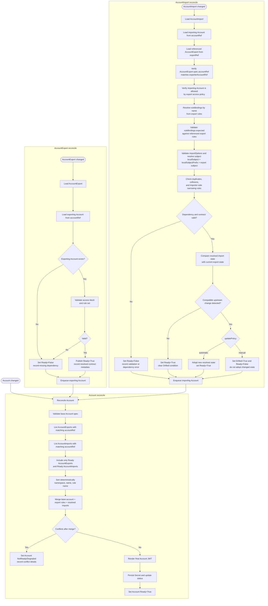

# Option 4 - Reconcile flow

`Account` remains the only resource that renders the final account JWT.
`AccountExport` and `AccountImport` reconcile their own readiness and status, and contribute validated inputs to the
owning account.

**Notes on the flow**

* `AccountExport` validates the exporter-owned contract: exporting account existence, access policy, unique rule names,
  valid rule definitions, and any export-only options.
* `AccountImport` validates the importer-owned binding: importing account existence, referenced export existence,
  `exporterAccountRef` match, allow-list membership, referenced rule existence, `ruleBindings[].expected`,
  importer-local `importOptions`, and subject/collision rules.
* `updatePolicy` only applies after the contract is otherwise valid. It does not weaken validation.
* `manual` means compatible upstream export changes are detected and surfaced as drift instead of being adopted.
  Until the import is updated to accept that change, it does not contribute to the rendered account JWT.

