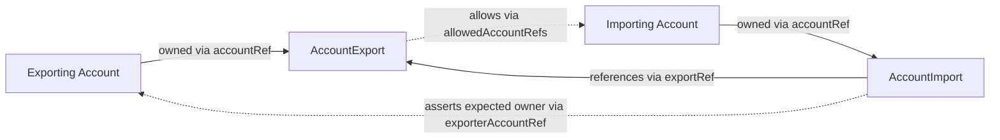
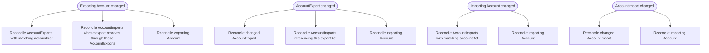

# Option 4 - Resource relationships and reconcile triggers

An effective import/export contract in Option 4 involves four primary resources:

1. the exporting `Account`
2. the `AccountExport` owned by that account
3. the importing `Account`
4. the `AccountImport` owned by that account

`AccountExport` represents an offer owned by the exporting account.
`AccountImport` represents a binding owned by the importing account.
The binding is only effective when both accounts exist, the referenced export exists, the referenced export belongs to
the expected exporting account, and the export allows the importing account.

**Readiness model**

* `AccountExport` is `Ready` when:
    * the exporting account exists
    * the export spec is valid
    * access policy is valid
    * rule names are unique and all rules are valid
* `AccountImport` is `Ready` when:
    * the importing account exists
    * the referenced export exists
    * the export belongs to `exporterAccountRef`
    * the importing account is allowed by the export
    * every named `ruleBinding` resolves to an export rule
    * every `ruleBindings[].expected` check passes
    * `importOptions` are valid and do not broaden the export contract
    * resolved local subjects are valid and non-conflicting
    * no compatible upstream drift is waiting for manual acceptance

This intentionally creates an asymmetry:

* `AccountExport` is an offer and may exist without any import
* `AccountImport` is a binding and depends on the export, the exporting account, and the importing account

**Reconcile trigger model**

Changes to any related resource must enqueue reconciliation of dependents. `Account` remains the only resource that
renders the final JWT.

**Expected behavior by changed resource**

* **Exporting `Account` changed**
    * reconcile `AccountExport` resources that reference it via `accountRef`
    * reconcile `AccountImport` resources whose referenced exports are owned by that account
    * reconcile that exporting `Account`

* **`AccountExport` changed**
    * reconcile that `AccountExport`
    * reconcile all `AccountImport` resources that reference it via `exportRef`
    * reconcile the exporting `Account`

* **Importing `Account` changed**
    * reconcile `AccountImport` resources that reference it via `accountRef`
    * reconcile that importing `Account`

* **`AccountImport` changed**
    * reconcile that `AccountImport`
    * reconcile the importing `Account`

**Implementation hint**

The controller will typically need field indexes for at least:

* `AccountExport.spec.accountRef`
* `AccountImport.spec.accountRef`
* `AccountImport.spec.exportRef`

This keeps the dependent requeues above practical without requiring broad scans.

**Operational rule**

Only ready `AccountExport` and ready `AccountImport` resources contribute to the final rendered account JWT.
If any required related resource is deleted, becomes invalid, or drifts under `updatePolicy: manual`, the effective
contract fails closed and must be excluded from the rendered account state until it becomes ready again.
