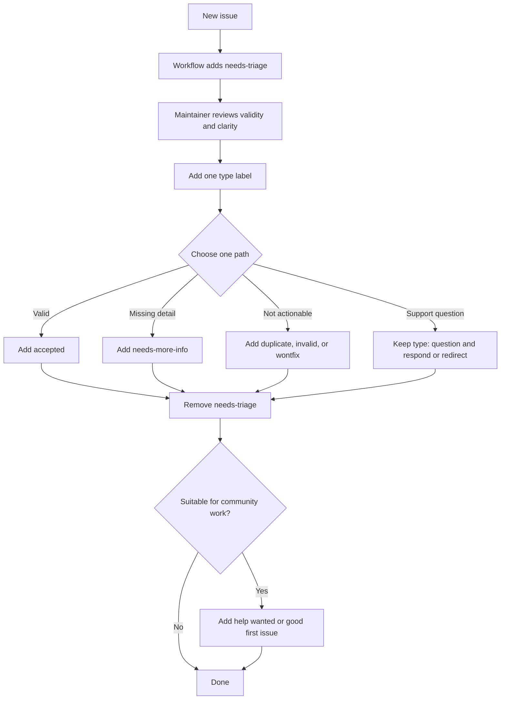

# Issue Triage Guide

This document is for maintainers only. 

## Goal

Review new community issues quickly and route them with a small, consistent label set.

## Default flow

1. New issues start with `needs-triage`, applied by workflow automation.
2. A maintainer checks whether the issue is valid and understandable.
3. Add exactly one type label:
   - `type: bug`
   - `type: feature`
   - `type: docs`
   - `type: question`
4. Choose exactly one outcome:
   - Valid and actionable: add `accepted`
   - Missing details: add `needs-more-info`
   - Not actionable: add one of `duplicate`, `invalid`, or `wontfix`
   - Support question: keep `type: question` and respond or redirect
5. Remove `needs-triage`.
6. If community contributions would help, add `help wanted` or `good first issue`.

## Labels

### Queue / state

- `needs-triage`: applied automatically when the issue is created, remove once triage is complete
- `accepted`: issue is valid and accepted after triage
- `needs-more-info`: issue is incomplete and needs follow-up

### Type

Set or update the type during the first triage pass.

- `type: bug`
- `type: feature`
- `type: docs`
- `type: question`

### Resolution

Use one of these when the issue should not move forward.

- `duplicate`
- `invalid`
- `wontfix`

### Contribution

Use these when community help is welcome.

- `help wanted`
- `good first issue`

### Optional planning

Use these only for internal prioritization when needed.

- `priority: high`
- `priority: medium`
- `priority: low`
