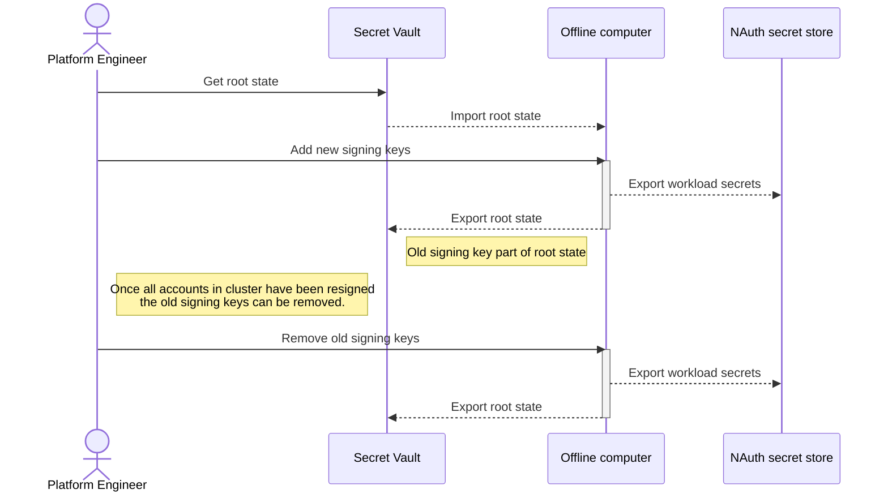

# NAuth Offline Operator handler

Handling a large NATS cluster which is constantly up requires the Operator keys to be secured rigorously. This serves as
an initial utility to solve the use case of provisioning an operator, but also to be able to **rotate keys** in a highly
available fashion.

## Dependencies
- [`nsc`](https://github.com/nats-io/nsc), which is part of the [NATS](https://nats.io) eco-system.
- [`7z`](https://www.7-zip.org/) - for packaging password protected artifacts used for importing/exporting

## Root store
It is recommended that the **root operator seed** is stored offline, since it is to be considered as a root CA in
[NATS Decentralized JWT AuthN/AuthZ](https://docs.nats.io/running-a-nats-service/configuration/securing_nats/auth_intro/jwt). The utility does not only handle the root operator seed as part of the
offline store, but also the **entire NSC store** containing:
- System Account & User
- Operator Signing Keys
- List of signing keys to be removed when rotating

## Input
The utility can create a new operator, but after this has been exported, it can be imported again in order to do
rotation operations to it.

The **root store** is the only import required, which is an `7z` archive containing a `nsc` store.

## Output
When the required rotation actions have been completed, the utility will output two artifacts:
- **Workload secrets** - New system Account user creds & operator signing key - to be used by NAuth
- **Root store** - The updated root information to be stored securely

## Workflow

